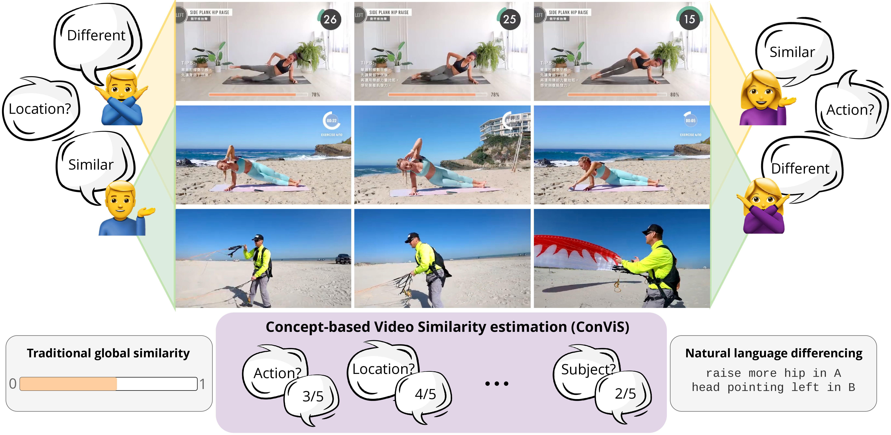

<div align="center">

[](http://arxiv.org/abs/2509.19245)
[](https://huggingface.co/datasets/bliberatori/ConViS-Bench)


# ConViS-Bench: Estimating Video Similarity Through Semantic Concepts

[Benedetta Liberatori](https://benedettaliberatori.github.io/), [Alessandro Conti](https://alessandroconti.me/), [Lorenzo Vaquero](), [Yiming Wang](https://www.yimingwang.it/), [Elisa Ricci](http://elisaricci.eu/), [Paolo Rota](https://paolorota.github.io/)<br>


<div align="left">

> **Abstract:** What does it mean for two videos to be similar? Videos may appear similar when judged by the actions they depict, yet entirely different if evaluated based on the locations where they were filmed. While humans naturally compare videos by taking different aspects into account, this ability has not been thoroughly studied and presents a challenge for models that often depend on broad global similarity scores.
Large Multimodal Models (LMMs) with video understanding capabilities open new opportunities for leveraging natural language in comparative video tasks.
We introduce Concept-based Video Similarity estimation  (ConViS), a novel task that compares pairs of videos by computing interpretable similarity scores across a predefined set of key semantic concepts. 
ConViS allows for human-like reasoning about video similarity and enables new applications such as concept-conditioned video retrieval. 
To support this task, we also introduce ConViS-Bench, a new benchmark comprising carefully annotated video pairs spanning multiple domains. 
Each pair comes with concept-level similarity scores and textual descriptions of both differences and similarities.
Additionally, we benchmark several state-of-the-art models on ConViS, providing insights into their alignment with human judgments. 
Our results reveal significant performance differences on ConViS, indicating that some concepts present greater challenges for estimating video similarity. We believe that ConViS-Bench will serve as a valuable resource for advancing research in language-driven video understanding.


# Download dataset 
Download the dataset from huggingface

```
$ mkdir ConViS-Bench/ 
$ huggingface-cli download bliberatori/ConViS-Bench --repo-type dataset --local-dir ConViS-Bench/
```
Note that if you change the directory name, you will need to provide it as `--video_dir` via command line for what follows. 

# Environment Setup
Create a conda environment and install all dependencies:

```
conda create -n convisenv python=3.12.2
conda activate convisenv
pip install -r requirements.txt
pip install torch==2.5.1 torchvision==0.20.1 torchaudio==2.5.1 --index-url https://download.pytorch.org/whl/cu121
```

**Note:** Due to conflicting dependencies across some model, we provide two additional requirements: 
- `requirements_qwen.txt` for qwen models 
- `requirements_t2v.txt` for VQAScore 

Please use the specific enviroments for these models.


# Computing Correlations
To compute correlation metrics across all tested models:
```
$ python -m baselines.compute_conditioned_correlation
```
This uses pre-computed similarities, stored in  `baselines/computed_similarities` and `baselines/computed_conditioned_similarities`, which can be computed as explained below. 


# Computing Pair Similarities

## LMMs 

For LMMs, results can be reproduced, selecting the model, the verison, the concept and the number of frames, by running:

```
$ python -m baselines.compute_conditioned_similarities \
  --vqa_model_path /path/to/model \
  --vqa_model_version /path/to/version \
  --max_frames_num <num_frames> \
  --concept_name <concept>
```
Concepts supported are: 

- `Location`
- `MainAction`
- `MainSubjects`
- `MainObjects`
- `OrderOfActions`

Models (and versions) supported are: 

- `mPLUG/mPLUG-Owl3-7B-240728` (`mplug-owl3-7b`)
- `lmms-lab/llava-onevision-qwen2-7b-ov` (`llava-onevision-qwen2-7b-ov`)
- `lmms-lab/llava-onevision-qwen2-0.5b-ov` (`llava-onevision-qwen2-0.5b-ov`)
- `lmms-lab/LLaVA-Video-7B-Qwen2`  (`llava-video-7b`)
- `OpenGVLab/InternVL2_5-4B` (`internvl2.5-4b`)
- `OpenGVLab/InternVL2_5-8B` (`internvl2.5-8b`) 
- `OpenGVLab/InternVL3-8B` (`internvl3-8b`)
- `Qwen/Qwen2.5-VL-3B-Instruct` (`qwen2.5-vl-3b`) 
- `Qwen/Qwen2.5-VL-7B-Instruct` (`qwen2.5-vl-7b`) 

Outputs will be saved to `baselines/computed_conditioned_similarities`. To vary the number of frames, override the `--conditioned_similarity_dir`. 

To run the closed-source Gemini, generate an API key from [Google AI Studio](https://aistudio.google.com/prompts/new_chat) and pass it as an argument:

```
$ python -m baselines.compute_conditioned_similarities_gemini \
  --apikey <your_API_KEY> \
  --concept_name <concept>
```


## Other models 

Code to run to pre-extract video fetures with models, from the project directory: 
```
$ python -m baselines.extract_features --model_path path/to/model
```

Models that requires pre-extraction of features are: 

- `MCG-NJU/videomae-large`
- `facebook/dinov2-large`
- `openai/clip-vit-large-patch14`
- `InternVideo/InternVideo-MM-L-14`

NB: to run InternVideo, load the checkpoint `InternVideo-MM-L-14.ckpt` from the [original repo](https://github.com/OpenGVLab/InternVideo/tree/main/InternVideo1#model-zoo) and place it in `baselines/InternVideo`. 

Compute similarities with all models:
```
$ python -m baselines.compute_similarities --model_path path/to/model
```

Models supported are:

- `MCG-NJU/videomae-large` 
- `facebook/dinov2-large`
- `mPLUG/mPLUG-Owl3-7B-240728`
- `OpenGVLab/InternVL2_5-8B`
- `Qwen/Qwen2.5-VL-7B-Instruct`
- `openai/clip-vit-large-patch14`
- `InternVideo/InternVideo-MM-L-14`
- `VQAScore/LLaVA-OneVision`


Results will be saved in `baselines/computed_similarities`. 


# Concept-based retrieval 

To compute Rec@1, Prec@1 and F1 metrics across all tested models:
```
$ python -m baselines.compute_retrieval_metrics
```

This uses pre-computed similarities, stored in  `baselines/computed_retrieval_scores` and `baselines/computed_retrieval_scores_unconditioned`, which can be computed as explained below. 

## LMMs

Run retrieval with: 

```
$ python -m baselines.perform_retrieval \
  --vqa_model_path /path/to/model \
  --vqa_model_version /path/to/version \
  --max_frames_num <num_frames> \
  --concept_name <concept>
```

## Other models

Run retrieval with: 

```
$ python -m baselines.perform_retrieval_unconditioned --model_path
```